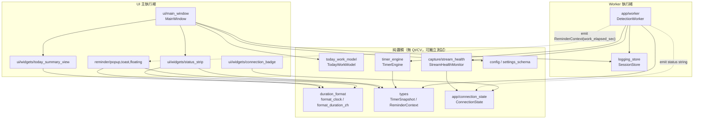
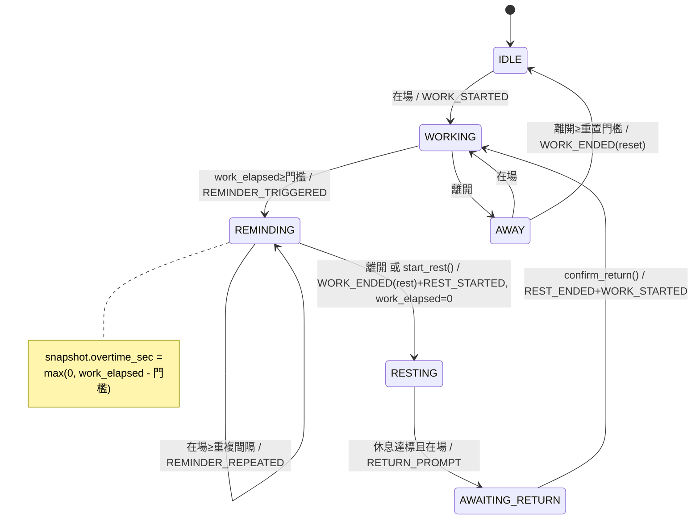
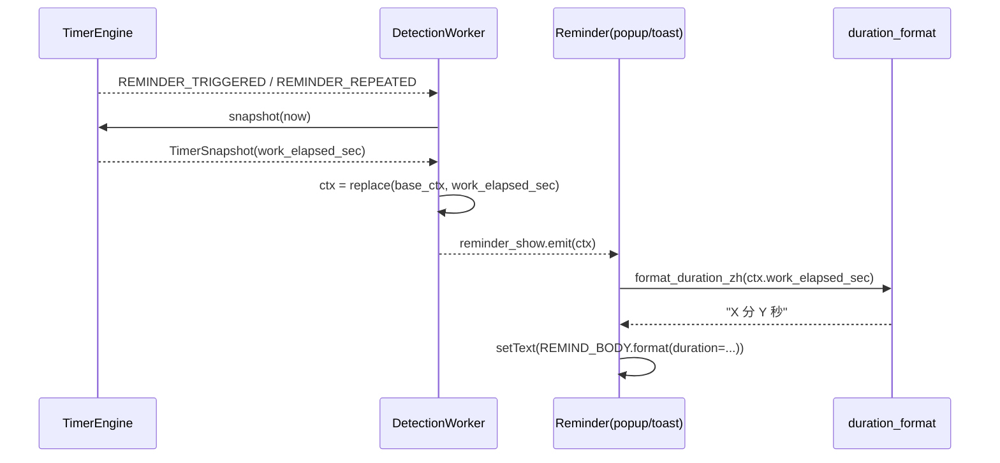
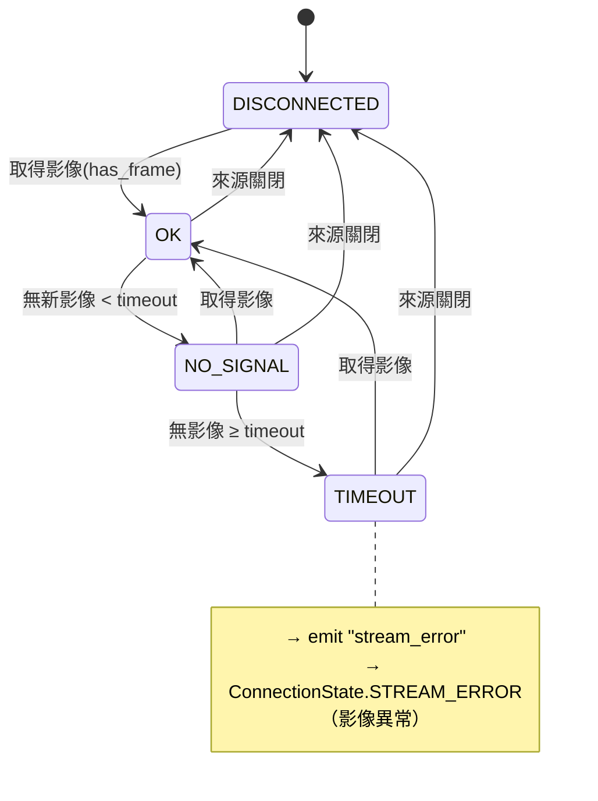

# 詳細設計文檔：人體辨識休息提醒系統 — 時間顯示與提醒異常修正

- **文件狀態**：草案（待實作）
- **上游文件**：`docs/proposal.md`（需求文檔，FR-1～FR-6）
- **組織方式**：以「程式元件/模組」為主軸，附 §6 FR↔模組追溯表
- **設計深度**：介面層級（含關鍵簽章與資料結構，不含完整實作）
- **重構策略**：於明顯提升獨立性與可測試性處抽出新模組（純邏輯），其餘就地最小修改
- **執行環境**：conda env `project`；PySide6 + OpenCV/YOLOv8 + SQLite

---

## 1. 概述與設計原則

本文件將 `proposal.md` 的 6 項需求落實為可實作、可獨立測試的模組設計。核心原則：

1. **純邏輯與框架分離**：時間語意、格式化、今日工作合併、串流健康判定等核心邏輯抽成**不依賴 Qt／OpenCV** 的純模組，可用注入時鐘（`clock`）做確定性單元測試。
2. **單一職責、明確介面**：每個模組只負責一件事，模組間以型別化的函式／資料類別溝通。
3. **檢視點集中於快照**：UI 只負責「呈現」`TimerSnapshot`，所有時間語意由 `TimerEngine` 算進快照，避免顯示端各自推導造成不一致（對應 proposal R-1）。
4. **向後相容**：新增設定具預設值；既有 `config.yaml` 缺欄位時採預設行為。

### 1.1 設計涵蓋與不涵蓋

- 涵蓋：FR-1～FR-6 對應的程式修改與新增模組、介面、互動、錯誤處理、測試點。
- 不涵蓋：偵測模型／ROI／休息判定模式之變更；UI 視覺改版；歷史報表。

---

## 2. 架構總覽

### 2.1 模組依賴圖



### 2.2 執行緒模型（與 FR-5 相關）

| 執行緒 | 主要元件 | 對 `SessionStore` 的存取 |
|---|---|---|
| UI 主執行緒 | `MainWindow`、各 widget、reminder | `today_summary()`（讀） |
| Worker 執行緒 | `DetectionWorker`、`TimerEngine`、`StreamHealthMonitor` | `init_schema()`、`log_session()`（寫） |
| Grabber 執行緒 | `FrameGrabber`（既有） | 不存取 DB |

**關鍵約束**：SQLite 連線採 per-thread。每個連線只能由**建立它的執行緒**使用與關閉。FR-5 即在保證「關閉連線」不跨執行緒（見 §4.7）。

---

## 3. 共用資料結構變更

集中列出跨模組的型別變更，作為各模組的共同契約。

### 3.1 `src/types.py`

```python
@dataclass(frozen=True)
class TimerSnapshot:
    state: TimerState
    work_elapsed_sec: float
    away_elapsed_sec: float
    remaining_to_reminder_sec: float
    reminder_active: bool
    rest_remaining_sec: float = 0.0
    rest_elapsed_sec: float = 0.0
    overtime_sec: float = 0.0          # ★ 新增：REMINDING 時 = max(0, work_elapsed - work_threshold)

@dataclass(frozen=True)
class ReminderContext:
    work_minutes: int                  # 保留（floating 倒數沿用，不動）
    media_path: str
    media_type: str
    sound_path: str
    work_elapsed_sec: float = 0.0      # ★ 新增：提醒觸發當下實際連續工作秒數
```

- `overtime_sec`：由 `TimerEngine.snapshot()` 計算；暫停時隨 `work_elapsed` 一併凍結。
- `work_elapsed_sec`（ReminderContext）：由 `DetectionWorker` 在派發提醒時注入；預設 0.0 確保既有建構呼叫相容。
- `reminder_active` 沿用既有語意（底層狀態為 REMINDING；暫停時仍為 True），供 `status_strip` 在 `SUSPENDED` 時選擇正確的顯示度量。

### 3.2 `src/config.py`

```python
@dataclass
class ReminderConfig:
    method: str = "popup"
    repeat_interval_min: float = 2.0
    reminding_display_mode: str = "overtime"   # ★ 新增："overtime" | "work_and_reminder"
    popup: PopupConfig = field(default_factory=PopupConfig)
    floating: FloatingConfig = field(default_factory=FloatingConfig)
```

`validate()` 增加：`reminder.reminding_display_mode` 必須為 `{"overtime", "work_and_reminder"}`；`_app_config_from_dict()` 以 `reminder_raw.get("reminding_display_mode", ReminderConfig.reminding_display_mode)` 讀入（缺欄位 → 預設 `overtime`，滿足向後相容）。

---

## 4. 模組詳細設計

> 每節格式：**職責 / 公開介面 / 資料結構 / 與其他模組互動 / 錯誤處理 / 測試點**。

### 4.1 `src/duration_format.py`（新增，純函式）

**職責**：把秒數格式化為顯示字串。為 `status_strip`（FR-1）與 reminder 文字（FR-3）共用的單一格式化來源。

**公開介面**

```python
def format_clock(seconds: float) -> str:
    """秒數 → 'MM:SS'。負數截為 0；分鐘可超過 99（如 '123:45'）。"""

def format_duration_zh(seconds: float) -> str:
    """秒數 → 動態中文時長：
       - seconds < 60  → 'N 秒'（向下取整，最小 '0 秒'）
       - seconds >= 60 → 餘秒為 0 時 'M 分鐘'，否則 'M 分 S 秒'
       例：30→'30 秒'、60→'1 分鐘'、90→'1 分 30 秒'、150→'2 分 30 秒'
    """
```

**資料結構**：無。

**互動**：被 `status_strip`、`popup`、`toast`、`today_summary_view` 匯入呼叫。

**錯誤處理**：非有限數（NaN/inf）或負數一律以 0 處理，不丟例外。

**測試點**（`tests/test_duration_format.py`）：
- `format_clock`：0→'00:00'、59→'00:59'、90→'01:30'、3661→'61:01'、-5→'00:00'。
- `format_duration_zh`：29.9→'29 秒'、30→'30 秒'、60→'1 分鐘'、90→'1 分 30 秒'、0→'0 秒'。

---

### 4.2 `src/today_work_model.py`（新增，純模型）

**職責**：合併「資料庫已完成工作秒數（base）」與「目前進行中工作秒數（in-progress）」，產出今日工作顯示值，並判斷何時需重抓 DB。對應 FR-4 的「即時累加且不重複計算」。

**公開介面**

```python
@dataclass(frozen=True)
class TodayWorkDisplay:
    display_seconds: int        # = base + in_progress
    base_refresh_needed: bool   # 進行中工作剛結束（in_progress 由 >0 轉 0）→ 需重抓 DB

class TodayWorkModel:
    def __init__(self) -> None: ...

    def set_base(self, work_seconds: int) -> None:
        """以 today_summary().work_seconds 設定基準（已完成 work session 總和）。"""

    def observe(self, snapshot: TimerSnapshot) -> TodayWorkDisplay:
        """輸入最新快照，回傳顯示值與是否需重抓 DB。"""
```

**核心邏輯**

- `in_progress(snapshot)`：等於 `snapshot.work_elapsed_sec`。前提是 `TimerEngine` 在「工作區段結束」時即把 `work_elapsed` 歸零（見 §4.4），故 `work_elapsed > 0` ⇔ 有一段尚未寫入 DB 的進行中工作。
- `display_seconds = round(base + in_progress)`。
- `base_refresh_needed = (prev_in_progress > 0) and (in_progress == 0)`；模型內部保存 `prev_in_progress`。
- 暫停（`SUSPENDED`）時 `work_elapsed` 已凍結，故 in-progress 不增加，顯示值停住（符合 AC-4.4）。

**互動**：由 `MainWindow` 持有；`set_base` 來源為 `SessionStore.today_summary()`；`observe` 輸入為 `on_timer_updated` 的快照。

**錯誤處理**：純計算，不存取外部資源；不丟例外。

**測試點**（`tests/test_today_work_model.py`）：
- 設 base=600，快照 work_elapsed=30 → display=630。
- 連續快照 work_elapsed 30→60，display 遞增且 `base_refresh_needed=False`。
- work_elapsed 由 60→0（工作結束）→ `base_refresh_needed=True`。
- `set_base` 更新後 in_progress=0 → display=新 base，且不重複累加。
- SUSPENDED 快照（work_elapsed 凍結）→ display 不變。

---

### 4.3 `src/capture/stream_health.py`（新增，純判定）

**職責**：依「是否取得影像／來源是否開啟／是否逾時」判定串流健康狀態，供 worker 轉成連線狀態（FR-6）。把「時間逾時判定」從 worker 抽出以利測試。

**公開介面**

```python
class StreamHealth(Enum):
    OK = "ok"                    # 正常取得影像
    NO_SIGNAL = "no_signal"      # 已開啟但短暫無新影像（< timeout）
    TIMEOUT = "timeout"          # 無影像達逾時門檻 → 影像異常
    DISCONNECTED = "disconnected"# 來源未開啟（重連中）

DEFAULT_STREAM_TIMEOUT_SEC: float = 10.0

class StreamHealthMonitor:
    def __init__(
        self,
        timeout_sec: float = DEFAULT_STREAM_TIMEOUT_SEC,
        clock: Callable[[], float] = time.monotonic,
    ) -> None: ...

    def update(self, has_frame: bool, is_opened: bool, now: float) -> StreamHealth:
        """每個偵測迴圈呼叫一次。
           has_frame=True            → 記錄 last_frame_t，回 OK
           has_frame=False, opened   → (now-last_frame_t) < timeout ? NO_SIGNAL : TIMEOUT
           is_opened=False           → DISCONNECTED
        """
```

- `last_frame_t` 初始為建立時的 `now`，避免啟動瞬間誤判逾時。
- App 層逾時門檻（預設 10s）獨立於 ffmpeg 內建 30s 逾時，讓 UI 更早反映異常。

**互動**：`DetectionWorker` 持有一個 `StreamHealthMonitor`，將 `StreamHealth` 映射為連線狀態字串（見 §4.6 worker 對映表）。

**錯誤處理**：純計算，不丟例外。

**測試點**（`tests/test_stream_health.py`）：
- 注入假時鐘；首次 `update(False, True, t0)` → NO_SIGNAL（未逾時）。
- 持續 `has_frame=False` 跨越 timeout → TIMEOUT。
- `is_opened=False` → DISCONNECTED。
- `has_frame=True` 後再 False，逾時計算自最後一張影像起算。

---

### 4.4 `src/timer_engine.py`（修改）

**職責**：計時狀態機。本次新增「超時量」、「工作結束完整記錄」、「暫停凍結契約」。

**介面變更**

- `snapshot(now)` 於回傳的 `TimerSnapshot` 增加：
  ```python
  overtime_sec = max(0.0, self._work_elapsed - self._work_threshold_sec) \
                 if self._state == TimerState.REMINDING else 0.0
  ```
  （以 `self._state` 判斷，使暫停時仍為凍結的超時值。）

- **工作結束完整記錄（FR-4 / proposal R-3）**：目前僅 `AWAY → IDLE` 重置會送 `WORK_ENDED`。新增「進入休息即結束工作」：
  - `REMINDING → RESTING`（自動離開、`start_rest()` 手動）兩條路徑，於送出 `REST_STARTED` 之前，先送：
    ```python
    self._event(TimerEventType.WORK_ENDED, now, duration_sec=self._work_elapsed, ended_by="rest")
    ```
    並隨即 `self._work_elapsed = 0.0`（確保 RESTING 期間 `work_elapsed=0`，使 `today_work_model` 不重複計算）。
  - `confirm_return()` 維持現狀（工作已於進入休息時結束，不再重複送 `WORK_ENDED`）。

- **暫停凍結契約（FR-2）**（沿用並明文化現有設計）：
  - `pause(now)`：記錄 `_state_before_pause`，`_paused=True`；**不**更新 `_work_elapsed`、**不**更新 `_last_t`。
  - 暫停期間 `update()` 立即回傳 `[]`，計時不前進。
  - `resume(now)`：`_paused=False`、`_last_t=now`（使下一次 `dt≈0`，不回補暫停期間）、還原 `_state`。
  - 不變式：恢復後 `work_elapsed` 單調不減，無回溯、無突跳。

**資料結構**：`TimerState`／`TimerEventType` 不新增成員；`WORK_ENDED` 的 `ended_by` 新增可能值 `"rest"`。

**互動**：`DetectionWorker.update()` 取事件並 `_dispatch`；`snapshot` 給 worker 轉發給 UI 與 reminder。

**錯誤處理**：純邏輯；`dt` 以 `max(0.0, now-last)` 夾住，避免時鐘倒退造成負值。

**測試點**（`tests/test_timer_engine.py` 擴充）：
- REMINDING 下 `overtime_sec` 自 0 起隨在場累加；未達 REMINDING 時為 0。
- `start_rest()` 與「自動離開進入休息」皆送出 `WORK_ENDED(duration=work_elapsed, ended_by="rest")`，且其後 `snapshot.work_elapsed_sec == 0`。
- 一輪「工作→提醒→休息→確認返回」中 `WORK_ENDED` 恰送一次（不重複）。
- 暫停後多次 `update()` 期間 `work_elapsed` 不變；恢復後第一筆 `update` 的 `dt≈0`、`work_elapsed` 不回溯。

---

### 4.5 `src/ui/widgets/status_strip.py`（修改）

**職責**：依快照與顯示模式呈現狀態文字、時間與進度條（FR-1、FR-2）。

**介面變更**

```python
def update_snapshot(
    self,
    snap: TimerSnapshot,
    work_threshold_sec: float,
    reminding_mode: str = "overtime",   # "overtime" | "work_and_reminder"
) -> None:
```

**渲染規則**

- 狀態標籤：一律 `STATE_TEXT[snap.state]`（含 `SUSPENDED → "已暫停"`）。
- 時間標籤：
  - `snap.state == RESTING`：沿用現有休息時間顯示（`rest_remaining` / `rest_elapsed`，以 `format_clock`）。
  - **`snap.reminder_active` 為 True**（REMINDING，或自 REMINDING 暫停的 SUSPENDED）：
    - `reminding_mode == "overtime"`：`f"超時 {format_clock(snap.overtime_sec)}"`
    - `reminding_mode == "work_and_reminder"`：`f"工作 {format_clock(snap.work_elapsed_sec)} / 提醒 {format_clock(snap.overtime_sec)}"`
  - 其餘狀態：`format_clock(snap.work_elapsed_sec)`。
- 進度條：非 RESTING 時 `maximum=work_threshold_sec`、`value=min(work_elapsed, max)`（提醒中即滿格）。

> SUSPENDED 時因 `work_elapsed`/`overtime` 已凍結且 `reminder_active` 仍反映底層狀態，顯示僅標籤由「提醒中／工作中」變為「已暫停」，數字凍結不跳變（AC-2.1、AC-2.4）。

**互動**：`MainWindow.on_timer_updated` 呼叫，傳入 `work_threshold_sec` 與 `reminding_mode`（取自 config）。

**錯誤處理**：未知 `reminding_mode` 退回 `"overtime"`。

**測試點**（`tests/test_ui.py` 擴充）：
- WORKING：顯示 `format_clock(work_elapsed)`。
- REMINDING + overtime：顯示 `"超時 00:xx"`，數值＝work_elapsed−threshold。
- REMINDING + work_and_reminder：同時含工作與提醒兩段。
- SUSPENDED（由 REMINDING 暫停）：標籤「已暫停」、數字＝凍結超時，不變。

---

### 4.6 提醒派發與顯示（FR-3）

涉及 `src/app/worker.py`（派發）、`src/reminder/popup.py`、`src/reminder/toast.py`、`src/ui/strings.py`。

#### 4.6.1 `DetectionWorker._dispatch`（修改）

**職責**：提醒事件發生時，注入「當下實際連續工作秒數」再發出 `reminder_show`。

```python
import dataclasses
...
if event.type in (TimerEventType.REMINDER_TRIGGERED, TimerEventType.REMINDER_REPEATED):
    snap = self._timer_engine.snapshot(self._clock())
    ctx = dataclasses.replace(self._reminder_context, work_elapsed_sec=snap.work_elapsed_sec)
    self.reminder_show.emit(ctx)
```

- `self._reminder_context` 維持為基底（媒體/音效/work_minutes），每次以 `replace` 產生帶實際秒數的新物件，不改動基底。
- 同節 worker 也承擔 FR-6 連線狀態與 FR-5 連線關閉（見 §4.7、§4.8）。

**串流健康 → 連線狀態字串對映**（worker run loop 使用 `StreamHealthMonitor`）：

| StreamHealth | emit 字串 | ConnectionState |
|---|---|---|
| OK | `"connected"` | CONNECTED |
| NO_SIGNAL | `"no_signal"` | NO_SIGNAL |
| TIMEOUT | `"stream_error"` | STREAM_ERROR（新增） |
| DISCONNECTED | `"reconnecting"` | RECONNECTING |

#### 4.6.2 `popup.py` / `toast.py`（修改）

```python
# popup.show / toast.show
self.message_label.setText(
    strings.REMIND_BODY.format(duration=format_duration_zh(ctx.work_elapsed_sec))
)
```

- `floating.py` 不變（其為倒數視窗，沿用 `ctx.work_minutes`，不顯示「已連續工作」文字）。

#### 4.6.3 `strings.py`（修改）

```python
REMIND_BODY = "你已連續工作 {duration}。"   # 由 {minutes} 改為 {duration}
CONN_STREAM_ERROR = "影像異常，畫面可能延遲或中斷。"   # 新增（FR-6 文案）
CONN_TEXT[ConnectionState.STREAM_ERROR] = "影像異常"   # 見 §4.8
```

**錯誤處理**：`work_elapsed_sec` 預設 0.0；即使未注入也只會顯示「0 秒」而非崩潰，但正常路徑必注入實際值。

**測試點**（`tests/test_reminder.py`、`tests/test_worker.py` 擴充）：
- 以 `ReminderContext(work_elapsed_sec=30)` 呼叫 `popup.show`，訊息含「30 秒」。
- 門檻 0.5 分觸發，worker 發出的 ctx `work_elapsed_sec≈30`，訊息不含「0 分鐘」。
- 重複提醒時 `work_elapsed_sec` 較前次大。

---

### 4.7 `src/logging_store.py`（修改，FR-5）

**職責**：per-thread SQLite 連線管理。修正關閉邏輯，避免跨執行緒關閉。

**介面變更**

```python
def close(self) -> None:
    """僅關閉『呼叫端執行緒』自己建立的連線；其他執行緒連線不動。"""
    thread_id = threading.get_ident()
    connection = self._connections.pop(thread_id, None)
    if connection is not None:
        connection.close()
```

- `_get_connection` / `init_schema` / `log_session` / `today_summary` 維持現狀（已 per-thread）。
- 不再提供「一次關閉全部」的行為（那正是跨執行緒例外來源）。
- 各執行緒各自負責關閉：Worker 執行緒於 `run()` 的 `finally` 呼叫 `close()`（關自己的連線）；UI 主執行緒於 `aboutToQuit` 呼叫一次 `store.close()`（見 §4.12）。

**互動**：`DetectionWorker`（worker 執行緒寫入＋關閉）、`MainWindow`/`main`（主執行緒讀取＋關閉）。

**錯誤處理**：呼叫端執行緒無連線時 `pop` 回 `None`，安全跳過；不丟例外。

**測試點**（`tests/test_logging_store` 或既有 store 測試擴充）：
- 主執行緒建立連線並查詢；另以 `threading.Thread` 建立第二連線並寫入後在該執行緒 `close()`；驗證主執行緒連線仍可用、且全程無 `ProgrammingError`。
- `close()` 後同執行緒再次 `_get_connection` 會建立新連線（冪等可重用）。

---

### 4.8 `connection_state.py` / `connection_badge.py` / `strings.py`（修改，FR-6）

**職責**：新增「影像異常」連線狀態並讓徽章可呈現。

**`app/connection_state.py` 變更**

```python
class ConnectionState(Enum):
    IDLE = "idle"
    CONNECTING = "connecting"
    CONNECTED = "connected"
    RECONNECTING = "reconnecting"
    NO_SIGNAL = "no_signal"
    STREAM_ERROR = "stream_error"   # ★ 新增
    ERROR = "error"

_STATUS_MAP["stream_error"] = ConnectionState.STREAM_ERROR
_SEVERITY[ConnectionState.STREAM_ERROR] = "warning"
_ICON_KEY[ConnectionState.STREAM_ERROR] = "conn-stream-error"
```

**`ui/widgets/connection_badge.py` 變更**

```python
_ICON_CHARS["conn-stream-error"] = "⚠"
```

**`ui/strings.py` 變更**：`CONN_TEXT[ConnectionState.STREAM_ERROR] = "影像異常"`（與 §4.6.3 一致）。

**`ui/main_window.py` 變更**（覆蓋預覽提示）：`on_connection_status` 的「顯示覆蓋文字」分支納入 `STREAM_ERROR`：

```python
if state in (NO_SIGNAL, RECONNECTING, CONNECTING, STREAM_ERROR):
    self._preview.set_overlay_text(CONN_TEXT.get(state, ""))
    self._presence_badge.set_present(False)
```

**降噪**：沿用 `logging_setup.suppress_decoder_noise()`（已設 `OPENCV_FFMPEG_LOGLEVEL=-8` 與 cv2 log level）。FR-6 要求確保此函式在 `main()` 啟動早期被呼叫（現況已於 `main()` 第一行呼叫）；不另解析 ffmpeg 訊息。

**錯誤處理**：`from_status` 對未知字串仍回 `IDLE`（現狀）。

**測試點**（`tests/test_*` 連線相關擴充）：
- `from_status("stream_error") == STREAM_ERROR`；`severity / icon_key / CONN_TEXT` 均有對應值。
- `ConnectionBadge.set_state(STREAM_ERROR)` 後 icon、文字正確且不丟例外。

---

### 4.9 `config.py` / `ui/settings_schema.py` / `config.yaml`（修改，FR-1 設定）

**職責**：新增「提醒中顯示模式」設定並接入設定畫面。

- `config.py`：見 §3.2（dataclass 欄位、`validate`、`_app_config_from_dict`）。
- `ui/settings_schema.py`：於「提醒」類別新增

```python
FieldSpec(
    "reminder.reminding_display_mode",
    "提醒中顯示",
    "提醒中要顯示『超時時間』還是『工作時間＋提醒持續時間』。",
    WidgetKind.CHOICE,
    "提醒",
    choices=("overtime", "work_and_reminder"),
)
```

- `config.yaml`：於 `reminder:` 下新增 `reminding_display_mode: overtime`（可省略，省略時採預設）。

**互動**：`MainWindow` 讀 `config.reminder.reminding_display_mode` 傳給 `status_strip`。

**錯誤處理**：`validate` 對非法值回報錯誤訊息；`load_config` 彙整後丟 `ConfigError`。

**測試點**（`tests/test_config.py`、`tests/test_settings_schema.py` 擴充）：
- 預設 config 的 `reminder.reminding_display_mode == "overtime"`。
- 缺欄位的舊 yaml 載入成功且採預設。
- 非法值（如 `"foo"`）使 `validate` 回報錯誤。
- schema 含該欄位且 `choices` 正確；`get_value`/`set_value` 可讀寫。

---

### 4.10 `src/ui/widgets/today_summary_view.py`（修改，FR-4）

**職責**：顯示今日工作（即時）與休息次數。工作改以秒級即時更新。

**介面變更**

```python
def set_today(self, work_seconds: int, rest_count: int) -> None:
    """工作以 format_duration_zh 顯示（每秒可見變化）；
       work_seconds==0 且 rest_count==0 → 顯示 TODAY_EMPTY。"""
```

- 取代原 `set_summary(TodaySummary)`；工作文字由「X 分鐘」改為 `format_duration_zh(work_seconds)`（如「1 分 30 秒」），滿足 AC-4.1「每次更新可見變化」。

**互動**：由 `MainWindow` 以 `model` 算出的 `display_seconds` 與最近一次 `today_summary().rest_count` 呼叫。

**測試點**（`tests/test_ui.py` 擴充）：
- `set_today(90, 2)` → 含「1 分 30 秒」「2 次」。
- `set_today(0, 0)` → 顯示空狀態文案。

---

### 4.11 `src/ui/main_window.py`（修改，FR-4 / FR-1）

**職責**：串接今日工作模型與顯示模式。

**變更要點**

```python
def __init__(self, config, store=None, config_path="config.yaml"):
    ...
    self._work_threshold_sec = config.timer.work_threshold_min * 60.0
    self._reminding_mode = config.reminder.reminding_display_mode   # ★
    self._today_model = TodayWorkModel()                            # ★
    self._rest_count = 0                                            # 最近一次 DB 休息次數
    ...
    self._refresh_base()        # 啟動先抓一次 base
    # 30s QTimer 作為保險刷新（沿用），timeout → _refresh_base

def _refresh_base(self) -> None:
    try:
        summary = self._store.today_summary()
        self._today_model.set_base(summary.work_seconds)
        self._rest_count = summary.rest_count
        self._summary.set_today(self._today_model.observe(self._last_snapshot).display_seconds
                                if self._last_snapshot else summary.work_seconds,
                                self._rest_count)
    except Exception:
        pass

def on_timer_updated(self, snap: TimerSnapshot) -> None:
    self._last_snapshot = snap
    result = self._today_model.observe(snap)
    if result.base_refresh_needed:
        self._refresh_base()                       # 工作剛結束已寫入 → 重抓 DB
        result = self._today_model.observe(snap)   # 以新 base 重算
    self._summary.set_today(result.display_seconds, self._rest_count)
    self._status.update_snapshot(snap, self._work_threshold_sec, self._reminding_mode)
```

- `_last_snapshot` 初始為 `None`。
- 30 秒 QTimer 仍保留，作為 base 的保險刷新（涵蓋整點換日等情況）。
- 即時性來源：`on_timer_updated`（每偵測迴圈 ~1s）。

**互動**：`store.today_summary()`（讀）、`TodayWorkModel`、`TodaySummaryView`、`StatusStrip`。

**錯誤處理**：DB 查詢以 `try/except` 包覆，失敗時沿用上次顯示，不影響 UI。

**測試點**（`tests/test_ui.py` 擴充，可用假 store/model）：
- 連續送 WORKING 快照，`today_summary_view` 工作秒數遞增。
- 送出「work_elapsed 由 >0 轉 0」的快照序列時，會觸發一次 `today_summary()` 重抓。
- 暫停快照下顯示值不增加。

---

### 4.12 `src/main.py`（修改，接線）

**變更要點**

- Worker 建立時注入 `StreamHealthMonitor`（於 `_build_worker` 或 worker 內部建立，timeout 取預設 10s）。
- `aboutToQuit` 收尾新增主執行緒關閉自己的 DB 連線：

```python
def _on_about_to_quit() -> None:
    preview_timer.stop()
    grabber.stop()
    _shutdown_worker_thread(worker, thread)   # worker 執行緒 finally 會關自己的連線
    store.close()                              # ★ 主執行緒關自己的連線（FR-5）
```

- `reminding_display_mode` 由 `MainWindow` 自 config 讀取，`main.py` 無需額外傳遞。

**測試點**：以既有 `tests/test_worker.py` 驗證 worker run/stop 不再出現跨執行緒例外（搭配假 store 記錄各執行緒 close 呼叫）。

---

## 5. 流程圖

### 5.1 計時狀態機（含工作結束記錄點）



### 5.2 提醒派發序列（FR-3）



### 5.3 今日工作資料流（FR-4）

```mermaid
flowchart LR
    DB[(SQLite sessions)] -->|today_summary().work_seconds| BASE[TodayWorkModel.base]
    SNAP[TimerSnapshot.work_elapsed_sec] -->|observe| MODEL[TodayWorkModel]
    BASE --> MODEL
    MODEL -->|display_seconds| VIEW[TodaySummaryView.set_today]
    MODEL -->|base_refresh_needed=True<br/>工作剛結束| REFRESH[MainWindow._refresh_base]
    REFRESH -->|set_base| BASE
```

### 5.4 串流健康狀態（FR-6）



---

## 6. FR ↔ 模組追溯表

| FR | 需求摘要 | 主要模組 | 對應驗收 |
|---|---|---|---|
| FR-1 | 提醒中時間語意（超時／工作+提醒，可設定） | `timer_engine`(overtime)、`types`、`status_strip`、`duration_format`、`config`/`settings_schema`、`main_window` | AC-1.1～1.3 |
| FR-2 | 暫停凍結、恢復不回溯 | `timer_engine`(pause/resume)、`status_strip`(SUSPENDED) | AC-2.1～2.4 |
| FR-3 | 彈窗實際工作時間＋動態單位 | `duration_format`、`types`(ReminderContext)、`worker`(_dispatch)、`popup`/`toast`、`strings` | AC-3.1～3.3 |
| FR-4 | 今日工作即時累加＋完整記錄 | `today_work_model`、`timer_engine`(WORK_ENDED 完整化)、`today_summary_view`、`main_window` | AC-4.1～4.4 |
| FR-5 | SQLite 連線只關自己執行緒 | `logging_store`(close)、`worker`(finally)、`main`(aboutToQuit) | AC-5.1～5.3 |
| FR-6 | 串流健康狀態呈現＋自動重連＋降噪 | `capture/stream_health`、`connection_state`(STREAM_ERROR)、`connection_badge`、`strings`、`worker`、`main_window`、`logging_setup`(沿用) | AC-6.1～6.3 |

---

## 7. 測試策略總表

| 模組 | 測試檔 | 性質 | 重點 |
|---|---|---|---|
| `duration_format` | `tests/test_duration_format.py`（新） | 純單元 | 邊界值與動態單位 |
| `today_work_model` | `tests/test_today_work_model.py`（新） | 純單元 | base+in_progress、refresh 旗標、暫停凍結 |
| `stream_health` | `tests/test_stream_health.py`（新） | 純單元（注入時鐘） | NO_SIGNAL/TIMEOUT/DISCONNECTED 判定 |
| `timer_engine` | `tests/test_timer_engine.py`（擴充） | 純單元（注入時鐘） | overtime、WORK_ENDED 完整化、暫停不回溯 |
| `types` | `tests/test_types.py`（擴充） | 純單元 | 新欄位預設值與相容 |
| `status_strip`/`today_summary_view`/`main_window` | `tests/test_ui.py`（擴充） | Qt（qtbot） | 顯示模式、即時累加、SUSPENDED 凍結 |
| reminder 派發 | `tests/test_reminder.py`、`tests/test_worker.py`（擴充） | Qt + 整合 | 注入 work_elapsed、文字格式、無「0 分鐘」 |
| `logging_store` | store 測試（擴充） | 多執行緒整合 | 只關自己連線、無跨執行緒例外 |
| `config`/`settings_schema` | `tests/test_config.py`、`tests/test_settings_schema.py`（擴充） | 純單元 | 新設定、向後相容、驗證 |
| `connection_state`/badge | 連線相關測試（擴充） | 純單元 + Qt | STREAM_ERROR 對映與呈現 |

- 時間相關一律以注入 `clock` 驗證，不依賴真實等待（NFR-2）。
- 串流中斷/逾時與 UI 呈現以重現步驟人工驗證為輔（AC-6.1～6.3）。

---

## 8. 風險、相依與相容性

| 編號 | 風險／相依 | 對策 |
|---|---|---|
| D-1 | FR-1/FR-3/FR-4 共用 `work_elapsed`，需基準一致 | 全部由 `TimerEngine.snapshot` 提供單一來源（對應 proposal R-1） |
| D-2 | FR-4「base+in_progress」在工作結束瞬間可能短暫落差 | `base_refresh_needed` 觸發即時重抓並以新 base 重算（§4.11，對應 R-2） |
| D-3 | 新增 `WORK_ENDED(rest)` 改變 work session 產生時機 | 不影響休息次數統計；以 `tests/test_timer_engine.py` 驗證恰送一次（對應 R-3） |
| D-4 | FR-5 改為各自關閉，主執行緒連線需有人關 | `main.aboutToQuit` 補主執行緒 `store.close()`（§4.12，對應 R-4） |
| D-5 | FR-6 降噪過度可能掩蓋真正中斷 | 逾時改由 `stream_health` 明確升級為 STREAM_ERROR 呈現於 UI（對應 R-5） |
| C-1 | 既有 `config.yaml` 無新欄位 | 預設 `overtime`，`load_config` 容許缺欄位 |
| C-2 | `ReminderContext`/`TimerSnapshot` 既有建構呼叫 | 新欄位皆有預設值，既有測試與呼叫相容 |
| C-3 | `floating` reminder 仍用 `work_minutes` | 保留該欄位、不動 floating 行為，FR-3 僅改文字型提醒 |

> 已知限制：若工作達提醒後使用者持續工作且未休息即關閉程式，該段工作不會寫入 DB（無結束事件）。屬現有設計範圍，本次不處理。

---

**附註**：本文件為介面層級設計；實作時若發現介面需微調，請同步更新本檔與 §6 追溯表，再進入實作計畫（TDD、逐模組）。
